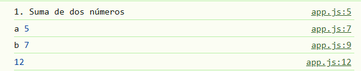

# Ejercicios de JavaScript (sin DOM)

# Actividad 2

## 1. Suma de dos números

**Enunciado**  
Escribe una función `sumar(a, b)` que reciba dos números y regrese la suma.

## Codigo

```javascript
console.log("1. Suma de dos números")
let a = 5
console.log("a", a)
let b = 7
console.log("b", b)

function sumar(a, b) {
    console.log(a + b)
    return a + b
}
sumar(a, b)
```



**Entrada de ejemplo**

```txt
a = 5
b = 7
```
Salida esperada

```text
12
```


## 2. Número par o impar
Enunciado
Crea una función `esPar(n)` que reciba un número entero y devuelva true si es par y false si es impar.

Entrada de ejemplo

```text
n = 10
n = 7
```
Salida esperada

```text
esPar(10) -> true
esPar(7)  -> false
```

## 3. Máximo de tres números
Enunciado
Implementa una función `maxDeTres(a, b, c)` que regrese el número más grande entre los tres.

Entrada de ejemplo

```text
a = 3
b = 15
c = 9
```
Salida esperada

```text
15
```

## 4. Reverso de una cadena
Enunciado
Escribe una función `reversoCadena(texto)` que reciba una cadena y devuelva la cadena invertida.

Entrada de ejemplo

```text
"hola"
```
Salida esperada

```text
"aloh"
```

## 5. Contar vocales en una cadena
Enunciado
Crea una función `contarVocales(texto)` que cuente cuántas vocales (a, e, i, o, u) hay en una cadena, sin importar mayúsculas/minúsculas.

Entrada de ejemplo

```text
"Programar es genial"
```
Salida esperada

```text
7
```

## 6. Eliminar duplicados de un arreglo
Enunciado
Implementa una función `sinDuplicados(arr)` que reciba un arreglo y devuelva uno nuevo sin elementos repetidos.

Entrada de ejemplo

```text
[1, 2, 2, 3, 4, 4, 4, 5]
```

Salida esperada

```text
[1, 2, 3, 4, 5]
```

## 7. Contador de palabras
Enunciado
Crea una función `contarPalabras(texto)` que reciba una cadena y devuelva cuántas palabras tiene. Considera que las palabras están separadas por espacios.

Entrada de ejemplo

```text
"JavaScript es muy divertido"
```
Salida esperada

```text
4
```

## 8. Frecuencia de elementos en un arreglo
Enunciado
Escribe una función `frecuencia(arr)` que reciba un arreglo y regrese un objeto donde las llaves sean los elementos y los valores cuántas veces aparecen.

Entrada de ejemplo

```text
["a", "b", "a", "c", "b", "a"]
```
Salida esperada

```text
{ a: 3, b: 2, c: 1 }
```

## 9. Validar palíndromo (ignorando espacios y mayúsculas)
Enunciado
Crea una función `esPalindromo(texto)` que determine si una cadena es un palíndromo, ignorando espacios y diferencias entre mayúsculas y minúsculas.

Entrada de ejemplo

```text
"Anita lava la tina"
"Hola mundo"
```

Salida esperada

```text
esPalindromo("Anita lava la tina") -> true
esPalindromo("Hola mundo")         -> false
```

## 10. Factorial recursivo y manejo de errores
Enunciado
Implementa una función `factorial(n)` que calcule el factorial de un número entero n usando recursión.
Si n es negativo o no es entero, la función debe lanzar un error.

Entrada de ejemplo

```text
n = 5
n = 0
n = -1
```
Salida esperada

```text
factorial(5) -> 120
factorial(0) -> 1
factorial(-1) -> Error (n debe ser >= 0)
```